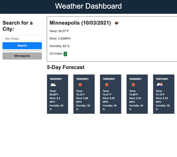

# weather dashboard

Homework #6 - weather dashboard

# what did I do?

This assignment included making a weather dashboard that displays portions of the current weather of a location. In addition, the user is presented with a 5 day forecast for the area. The user can search for another location and get the same information for that location.

All areas that the user searches are historically placed below the main search button.

# what do I need to explain

I chose to make the default location that is searched 'Minneapolis'. This value is immediately injected into the search history. I made this decision so that the user wasn't forced to add a seach term in order to understand what this website does.

# github pages link

https://bretpeters3n.github.io/weather-dashboard/

# screenshot of final product

